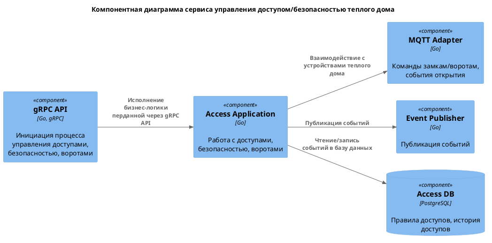

```puml
@startuml
!include <C4/C4_Component>
LAYOUT_LEFT_RIGHT()
title Компонентная диаграмма сервиса управления доступом/безопасностью теплого дома

  Component(api, "gRPC API", "Go, gRPC", "Инициация процесса управления доступами, безопасностью, воротами")
  Component(app, "Access Application", "Go", "Работа с доступами, безопасностью, воротами")
  Component(mqtt, "MQTT Adapter", "Go", "Команды замкам/воротам, события открытия")
  Component(pub, "Event Publisher", "Go", "Публикация событий")

ComponentDb(db, "Access DB", "PostgreSQL", "Правила доступов, история доступов")

Rel(api, app, "Исполнение бизнес-логики перданной через gRPC API")
Rel(app, mqtt, "Взаимодействие с устройствами теплого дома")
Rel(app, db, "Чтение/запись событий в базу данных")
Rel(app, pub, "Публикация событий")
@enduml
```