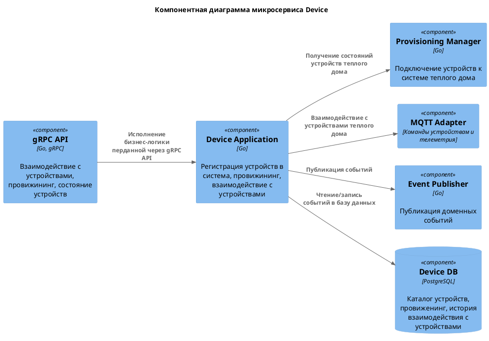

```puml
@startuml
!include <C4/C4_Component>
LAYOUT_LEFT_RIGHT()
title Компонентная диаграмма микросервиса Device


  Component(api, "gRPC API", "Go, gRPC", "Взаимодействие с устройствами, провижининг, состояние устройств")
  Component(app, "Device Application", "Go", "Регистрация устройств в система, провижининг, взаимодействие с устройствами")
  Component(prov, "Provisioning Manager", "Go", "Подключение устройств к системе теплого дома")
  Component(mqtt, "MQTT Adapter", "Команды устройствам и телеметрия")
  Component(pub, "Event Publisher", "Go", "Публикация доменных событий")

ComponentDb(db, "Device DB", "PostgreSQL", "Каталог устройств, провиженинг, история взаимодействия с устройствами")

Rel(api, app, "Исполнение бизнес-логики перданной через gRPC API")
Rel(app, prov, "Получение состояний устройств теплого дома")
Rel(app, mqtt, "Взаимодействие с устройствами теплого дома")
Rel(app, db, "Чтение/запись событий в базу данных")
Rel(app, pub, "Публикация событий")
@enduml
```