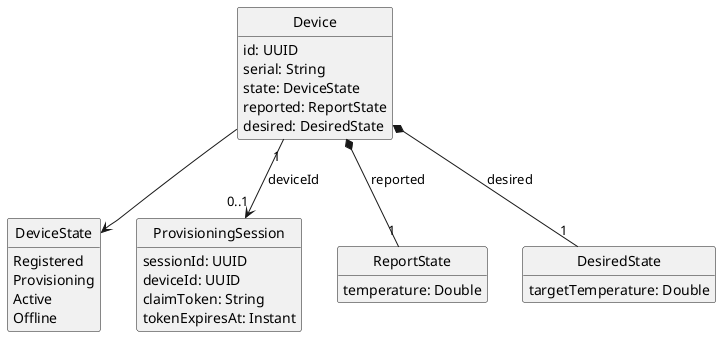

```puml
@startuml DeviceServiceCode
skinparam classAttributeIconSize 0
hide empty members
hide circle

enum DeviceState {
  Registered
  Provisioning
  Active
  Offline
}

class Device {
  id: UUID
  serial: String 
  state: DeviceState
  reported: ReportState
  desired: DesiredState
}

class ProvisioningSession {
  sessionId: UUID
  deviceId: UUID
  claimToken: String 
  tokenExpiresAt: Instant 
}

class ReportState {
  temperature: Double
}

class DesiredState {
  targetTemperature: Double
}

Device "1" --> "0..1" ProvisioningSession : deviceId
Device --> DeviceState
Device *-- "1" ReportState : reported
Device *-- "1" DesiredState : desired
@enduml
```