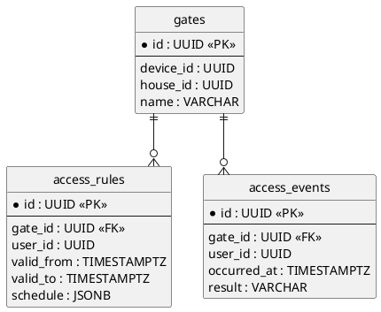

```puml
@startuml
hide circle
skinparam linetype ortho

entity "gates" as gates {
  * id : UUID <<PK>>
  --
  device_id : UUID
  house_id : UUID
  name : VARCHAR
}

entity "access_rules" as ar {
  * id : UUID <<PK>>
  --
  gate_id : UUID <<FK>>
  user_id : UUID
  valid_from : TIMESTAMPTZ
  valid_to : TIMESTAMPTZ
  schedule : JSONB
}

entity "access_events" as ae {
  * id : UUID <<PK>>
  --
  gate_id : UUID <<FK>>
  user_id : UUID
  occurred_at : TIMESTAMPTZ
  result : VARCHAR
}

gates ||--o{ ar
gates ||--o{ ae
@enduml
```