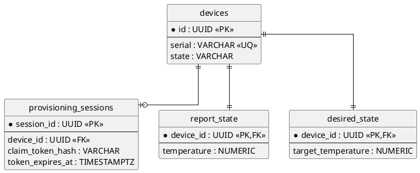

```puml
@startuml
hide circle
skinparam linetype ortho

entity "devices" as devices {
  * id : UUID <<PK>>
  --
  serial : VARCHAR <<UQ>>
  state : VARCHAR
}

entity "provisioning_sessions" as ps {
  * session_id : UUID <<PK>>
  --
  device_id : UUID <<FK>>
  claim_token_hash : VARCHAR
  token_expires_at : TIMESTAMPTZ
}

entity "report_state" as rs {
  * device_id : UUID <<PK,FK>>
  --
  temperature : NUMERIC
}

entity "desired_state" as ds {
  * device_id : UUID <<PK,FK>>
  --
  target_temperature : NUMERIC
}

devices ||--o| ps
devices ||--|| rs
devices ||--|| ds
@enduml
```