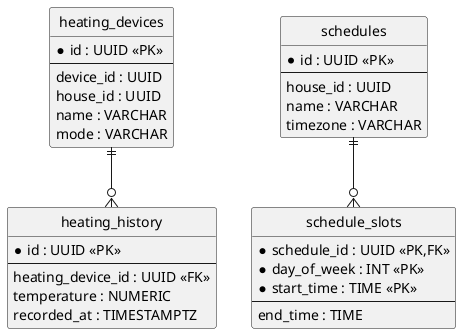

```puml
@startuml
hide circle
skinparam linetype ortho

entity "heating_devices" as hd {
  * id : UUID <<PK>>
  --
  device_id : UUID
  house_id : UUID
  name : VARCHAR
  mode : VARCHAR
}

entity "schedules" as sch {
  * id : UUID <<PK>>
  --
  house_id : UUID
  name : VARCHAR
  timezone : VARCHAR
}

entity "schedule_slots" as slot {
  * schedule_id : UUID <<PK,FK>>
  * day_of_week : INT <<PK>>
  * start_time : TIME <<PK>>
  --
  end_time : TIME
}

entity "heating_history" as hist {
  * id : UUID <<PK>>
  --
  heating_device_id : UUID <<FK>>
  temperature : NUMERIC
  recorded_at : TIMESTAMPTZ
}

sch ||--o{ slot
hd ||--o{ hist
@enduml
```