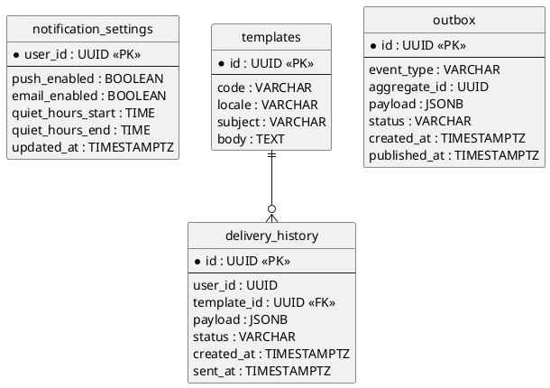

```puml
@startuml
hide circle
skinparam linetype ortho

entity "notification_settings" as ns {
  * user_id : UUID <<PK>>
  --
  push_enabled : BOOLEAN
  email_enabled : BOOLEAN
  quiet_hours_start : TIME
  quiet_hours_end : TIME
  updated_at : TIMESTAMPTZ
}

entity "templates" as tpl {
  * id : UUID <<PK>>
  --
  code : VARCHAR
  locale : VARCHAR
  subject : VARCHAR
  body : TEXT
}

entity "delivery_history" as dh {
  * id : UUID <<PK>>
  --
  user_id : UUID
  template_id : UUID <<FK>>
  payload : JSONB
  status : VARCHAR
  created_at : TIMESTAMPTZ
  sent_at : TIMESTAMPTZ
}

entity "outbox" as ob {
  * id : UUID <<PK>>
  --
  event_type : VARCHAR
  aggregate_id : UUID
  payload : JSONB
  status : VARCHAR
  created_at : TIMESTAMPTZ
  published_at : TIMESTAMPTZ
}

tpl ||--o{ dh
@enduml
```