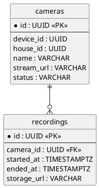

```puml
@startuml
hide circle
skinparam linetype ortho

entity "cameras" as cam {
  * id : UUID <<PK>>
  --
  device_id : UUID
  house_id : UUID
  name : VARCHAR
  stream_url : VARCHAR
  status : VARCHAR
}

entity "recordings" as rec {
  * id : UUID <<PK>>
  --
  camera_id : UUID <<FK>>
  started_at : TIMESTAMPTZ
  ended_at : TIMESTAMPTZ
  storage_url : VARCHAR
}

cam ||--o{ rec
@enduml
```