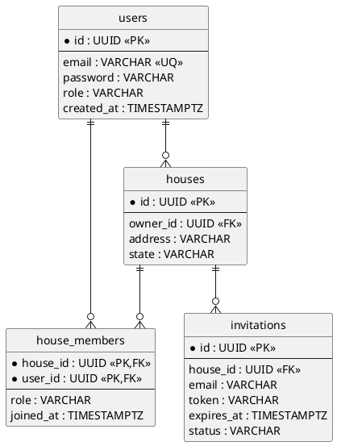

```puml
@startuml
hide circle
skinparam linetype ortho

entity "users" as users {
  * id : UUID <<PK>>
  --
  email : VARCHAR <<UQ>>
  password : VARCHAR
  role : VARCHAR
  created_at : TIMESTAMPTZ
}

entity "houses" as houses {
  * id : UUID <<PK>>
  --
  owner_id : UUID <<FK>>
  address : VARCHAR
  state : VARCHAR
}

entity "house_members" as hm {
  * house_id : UUID <<PK,FK>>
  * user_id : UUID <<PK,FK>>
  --
  role : VARCHAR
  joined_at : TIMESTAMPTZ
}

entity "invitations" as inv {
  * id : UUID <<PK>>
  --
  house_id : UUID <<FK>>
  email : VARCHAR
  token : VARCHAR
  expires_at : TIMESTAMPTZ
  status : VARCHAR
}

users ||--o{ houses
users ||--o{ hm
houses ||--o{ hm
houses ||--o{ inv
@enduml
```