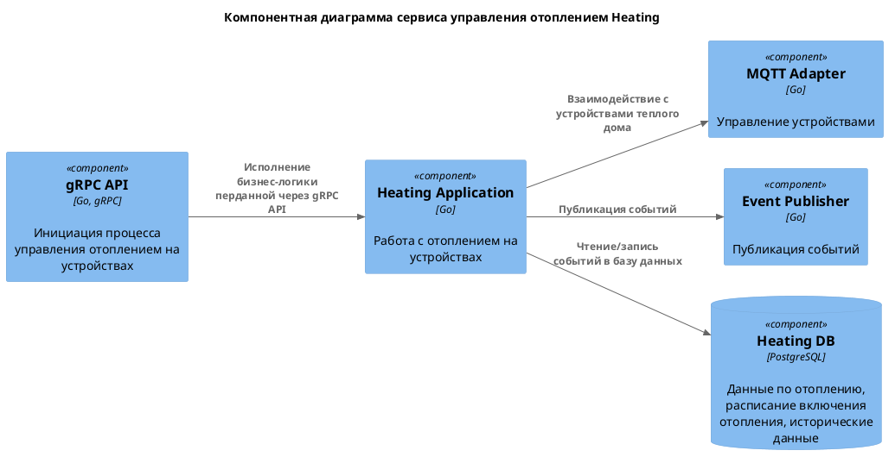

```puml
@startuml
!include <C4/C4_Component>
LAYOUT_LEFT_RIGHT()
title Компонентная диаграмма сервиса управления отоплением Heating

  Component(api, "gRPC API", "Go, gRPC", "Инициация процесса управления отоплением на устройствах")
  Component(app, "Heating Application", "Go", "Работа с отоплением на устройствах")
  Component(mqtt, "MQTT Adapter", "Go", "Управление устройствами")
  Component(pub, "Event Publisher", "Go", "Публикация событий")

ComponentDb(db, "Heating DB", "PostgreSQL", "Данные по отоплению, расписание включения отопления, исторические данные")

Rel(api, app, "Исполнение бизнес-логики перданной через gRPC API")
Rel(app, mqtt, "Взаимодействие с устройствами теплого дома")
Rel(app, db, "Чтение/запись событий в базу данных")
Rel(app, pub, "Публикация событий")
@enduml
```