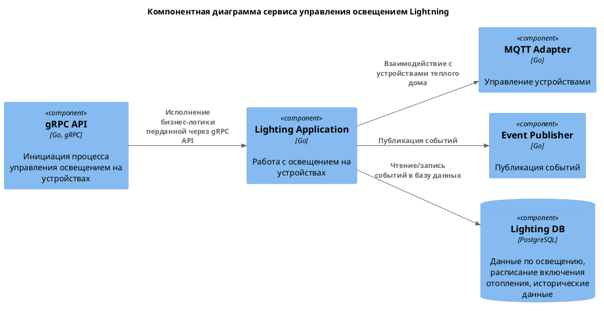

```puml
@startuml
!include <C4/C4_Component>
LAYOUT_LEFT_RIGHT()
title Компонентная диаграмма сервиса управления освещением Lightning

  Component(api, "gRPC API", "Go, gRPC", "Инициация процесса управления освещением на устройствах")
  Component(app, "Lighting Application", "Go", "Работа с освещением на устройствах")
  Component(mqtt, "MQTT Adapter", "Go", "Управление устройствами")
  Component(pub, "Event Publisher", "Go", "Публикация событий")

ComponentDb(db, "Lighting DB", "PostgreSQL", "Данные по освещению, расписание включения отопления, исторические данные")

Rel(api, app, "Исполнение бизнес-логики перданной через gRPC API")
Rel(app, mqtt, "Взаимодействие с устройствами теплого дома")
Rel(app, db, "Чтение/запись событий в базу данных")
Rel(app, pub, "Публикация событий")
@enduml
```