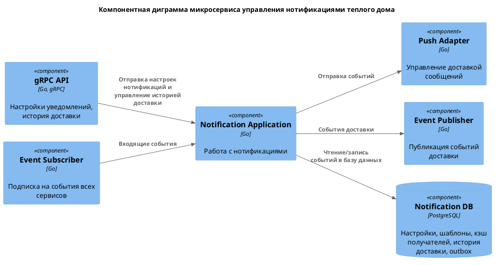

```puml
@startuml
!include <C4/C4_Component>
LAYOUT_LEFT_RIGHT()
title Компонентная диграмма микросервиса управления нотификациями теплого дома 

  Component(api, "gRPC API", "Go, gRPC", "Настройки уведомлений, история доставки")
  Component(app, "Notification Application", "Go", "Работа с нотификациями")
  Component(push, "Push Adapter", "Go", "Управление доставкой сообщений")
  Component(sub, "Event Subscriber", "Go", "Подписка на события всех сервисов")
  Component(pub, "Event Publisher", "Go", "Публикация событий доставки")

ComponentDb(db, "Notification DB", "PostgreSQL", "Настройки, шаблоны, кэш получателей, история доставки, outbox")

Rel(api, app, "Отправка настроек нотификаций и управление историей доставки")
Rel(sub, app, "Входящие события")
Rel(app, push, "Отправка событий")
Rel(app, db, "Чтение/запись событий в базу данных")
Rel(app, pub, "События доставки")
@enduml
```