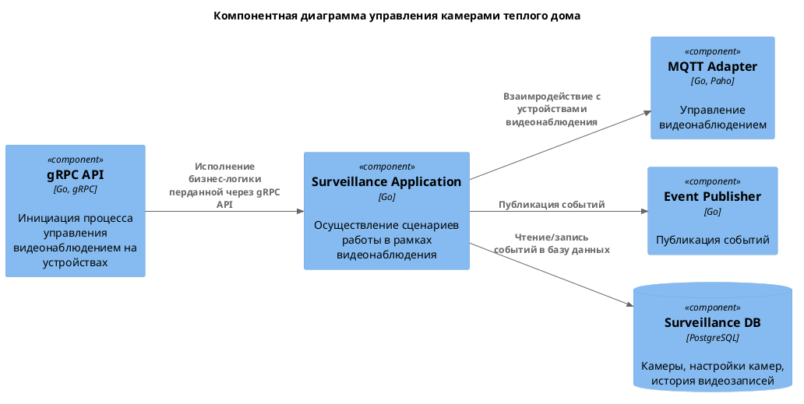

```puml
@startuml
!include <C4/C4_Component>
LAYOUT_LEFT_RIGHT()
title Компонентная диаграмма управления камерами теплого дома 

  Component(api, "gRPC API", "Go, gRPC", "Инициация процесса управления видеонаблюдением на устройствах")
  Component(app, "Surveillance Application", "Go", "Осуществление сценариев работы в рамках видеонаблюдения")
  Component(mqtt, "MQTT Adapter", "Go, Paho", "Управление видеонаблюдением")
  Component(pub, "Event Publisher", "Go", "Публикация событий")

ComponentDb(db, "Surveillance DB", "PostgreSQL", "Камеры, настройки камер, история видеозаписей")

Rel(api, app, "Исполнение бизнес-логики перданной через gRPC API")
Rel(app, mqtt, "Взаимродействие с устройствами видеонаблюдения")
Rel(app, db, "Чтение/запись событий в базу данных")
Rel(app, pub, "Публикация событий")
@enduml
```