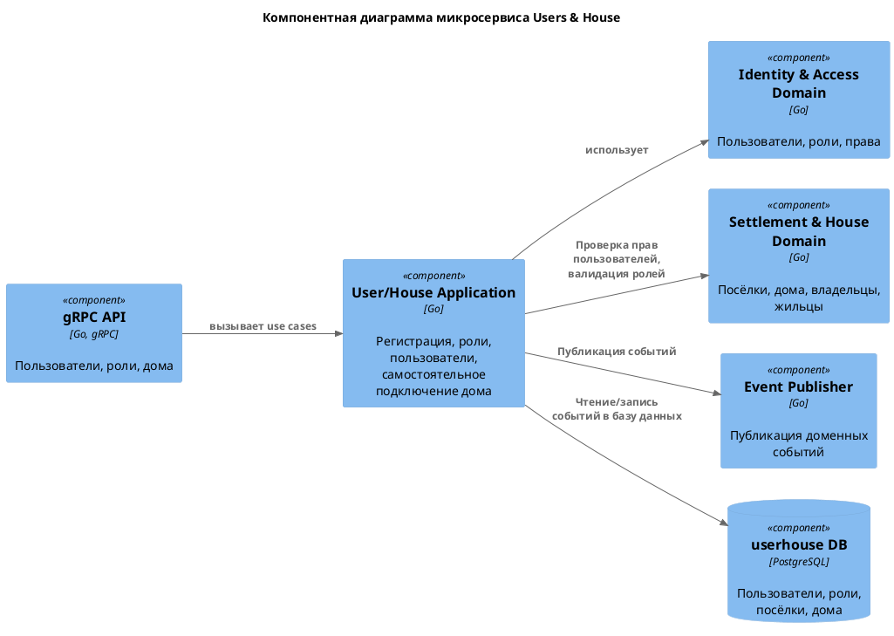

```puml
@startuml
!include <C4/C4_Component>
LAYOUT_LEFT_RIGHT()
title Компонентная диаграмма микросервиса Users & House 

  Component(api, "gRPC API", "Go, gRPC", "Пользователи, роли, дома")
  Component(app, "User/House Application", "Go", "Регистрация, роли, пользователи, самостоятельное подключение дома")
  Component(userhouseDomain, "Identity & Access Domain", "Go", "Пользователи, роли, права")
  Component(settleDomain, "Settlement & House Domain", "Go", "Посёлки, дома, владельцы, жильцы")
  Component(pub, "Event Publisher", "Go", "Публикация доменных событий")

ComponentDb(db, "userhouse DB", "PostgreSQL", "Пользователи, роли, посёлки, дома")

Rel(api, app, "вызывает use cases")
Rel(app, userhouseDomain, "использует")
Rel(app, settleDomain, "Проверка прав пользователей, валидация ролей")
Rel(app, db, "Чтение/запись событий в базу данных")
Rel(app, pub, "Публикация событий")
@enduml
```