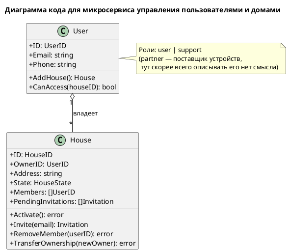

```puml
@startuml
title Диаграмма кода для микросервиса управления пользователями и домами

skinparam classAttributeIconSize 0

class User {
  +ID: UserID
  +Email: string
  +Phone: string
  --
  +AddHouse(): House
  +CanAccess(houseID): bool
}

class House {
  +ID: HouseID
  +OwnerID: UserID
  +Address: string
  +State: HouseState
  +Members: []UserID
  +PendingInvitations: []Invitation
  --
  +Activate(): error
  +Invite(email): Invitation
  +RemoveMember(userID): error
  +TransferOwnership(newOwner): error
}

User "1" o-- "*" House : владеет

note right of User
  Роли: user | support
  (partner — поставщик устройств,
   тут скорее всего описывать его нет смысла)
end note
@enduml
```