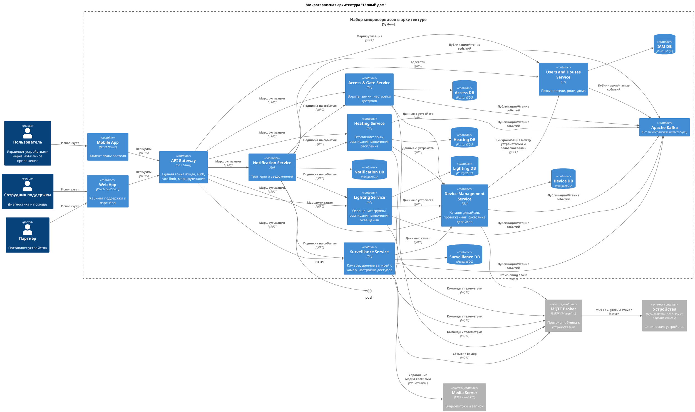

```puml
@startuml
!include <C4/C4_Container>
LAYOUT_LEFT_RIGHT()

title Микросервисная архитектура "Тёплый дом"

Person(user, "Пользователь", "Управляет устройствами через мобильное приложение")
Person(support, "Сотрудник поддержки", "Диагностика и помощь")
Person(partner, "Партнёр", "Поставляет устройства")

System_Boundary(eco, "Набор микросервисов в архитектуре") {
  Container(mobile, "Mobile App", "React Native", "Клиент пользователя")
  Container(web, "Web App", "React/TypeScript", "Кабинет поддержки и партнёра")
  Container(api, "API Gateway", "Go / Envoy", "Единая точка входа, auth, rate-limit, маршрутизация")
  
  Container(userhouse, "Users and Houses Service", "Go", "Пользователи, роли, дома")
  Container(dms, "Device Management Service", "Go", "Каталог девайсов, провиженинг, состояние девайсов")
  Container(heat, "Heating Service", "Go", "Отопление: зоны, расписания включения отоплениz")
  Container(light, "Lighting Service", "Go", "Освещение: группы, расписания включения освещения")
  Container(gate, "Access & Gate Service", "Go", "Ворота, замки, настройки доступов")
  Container(surv, "Surveillance Service", "Go", "Камеры, данные записей с камер, настройки доступов")
  Container(notif, "Notification Service", "Go", "Триггеры и уведомления")
  
  Container(kafka, "Apache Kafka", "Все межсервисные интеграции")

  ContainerDb(db_userhouse, "IAM DB", "PostgreSQL")
  ContainerDb(db_dms, "Device DB", "PostgreSQL")
  ContainerDb(db_heat, "Heating DB", "PostgreSQL")
  ContainerDb(db_light, "Lighting DB", "PostgreSQL")
  ContainerDb(db_gate, "Access DB", "PostgreSQL")
  ContainerDb(db_surv, "Surveillance DB", "PostgreSQL")
  ContainerDb(db_notif, "Notification DB", "PostgreSQL")
}

Container_Ext(mqtt, "MQTT Broker", "EMQX / Mosquitto", "Протокол обмена с устройствами")
Container_Ext(devices, "Устройства", "Термостаты, реле, замки, ворота, камеры", "Физические устройства")
Container_Ext(media, "Media Server", "RTSP / WebRTC", "Видеопотоки и записи")

Rel(dms, mqtt, "Provisioning / twin", "MQTT")
Rel(heat, mqtt, "Команды / телеметрия", "MQTT")
Rel(light, mqtt, "Команды / телеметрия", "MQTT")
Rel(gate, mqtt, "Команды / телеметрия", "MQTT")
Rel(surv, mqtt, "События камер", "MQTT")
Rel(mqtt, devices, "MQTT / Zigbee / Z-Wave / Matter")
Rel(surv, media, "Управление медиа-сессиями", "RTSP/WebRTC")

Rel(user, mobile, "Использует")
Rel(support, web, "Использует")
Rel(partner, web, "Использует")

Rel(mobile, api, "REST/JSON", "HTTPS")
Rel(web, api, "REST/JSON", "HTTPS")

Rel(api, userhouse, "Маршрутизация","gRPC")
Rel(api, dms, "Маршрутизация","gRPC")
Rel(api, heat, "Маршрутизация","gRPC")
Rel(api, light, "Маршрутизация","gRPC")
Rel(api, gate, "Маршрутизация","gRPC")
Rel(api, surv, "Маршрутизация","gRPC")
Rel(api, notif, "Маршрутизация","gRPC")


Rel(dms, userhouse, "Синхронизация между устройствами и пользователями", "gRPC")
Rel(heat, dms, "Данные с  устройств", "gRPC")
Rel(light, dms, "Данные с устройств", "gRPC")
Rel(gate, dms, "Данные с устройств", "gRPC")
Rel(surv, dms, "Данные с камер", "gRPC")

Rel(userhouse, kafka, "Публикация/Чтение событий " )
Rel(dms, kafka, "Публикация/Чтение событий")
Rel(heat, kafka, "Публикация/Чтение событий")
Rel(light, kafka, "Публикация/Чтение событий")
Rel(gate, kafka, "Публикация/Чтение событий")
Rel(surv, kafka, "Публикация/Чтение событий")
Rel(notif, kafka, "Публикация/Чтение событий")

Rel(notif, heat, "Подписка на события", "gRPC")
Rel(notif, light, "Подписка на события", "gRPC")
Rel(notif, gate, "Подписка на события", "gRPC")
Rel(notif, surv, "Подписка на события", "gRPC")
Rel(notif, userhouse, "Адресаты", "gRPC")
Rel(notif, push, "HTTPS")

Rel(userhouse, db_userhouse, "")
Rel(dms, db_dms, "")
Rel(heat, db_heat, "")
Rel(light, db_light, "")
Rel(gate, db_gate, "")
Rel(surv, db_surv, "")
Rel(notif, db_notif, "")
```