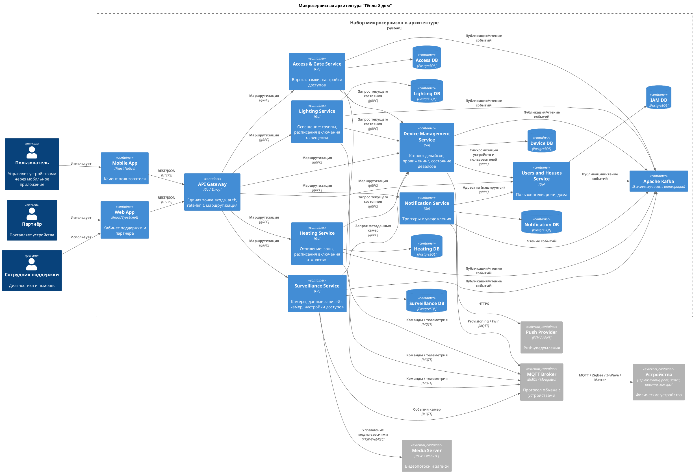

```puml
@startuml
!include <C4/C4_Container>
LAYOUT_LEFT_RIGHT()

title Микросервисная архитектура "Тёплый дом"

Person(user, "Пользователь", "Управляет устройствами через мобильное приложение")
Person(support, "Сотрудник поддержки", "Диагностика и помощь")
Person(partner, "Партнёр", "Поставляет устройства")

System_Boundary(eco, "Набор микросервисов в архитектуре") {
  Container(mobile, "Mobile App", "React Native", "Клиент пользователя")
  Container(web, "Web App", "React/TypeScript", "Кабинет поддержки и партнёра")
  Container(api, "API Gateway", "Go / Envoy", "Единая точка входа, auth, rate-limit, маршрутизация")

  Container(userhouse, "Users and Houses Service", "Go", "Пользователи, роли, дома")
  Container(dms, "Device Management Service", "Go", "Каталог девайсов, провиженинг, состояние девайсов")
  Container(heat, "Heating Service", "Go", "Отопление: зоны, расписания включения отопления")
  Container(light, "Lighting Service", "Go", "Освещение: группы, расписания включения освещения")
  Container(gate, "Access & Gate Service", "Go", "Ворота, замки, настройки доступов")
  Container(surv, "Surveillance Service", "Go", "Камеры, данные записей с камер, настройки доступов")
  Container(notif, "Notification Service", "Go", "Триггеры и уведомления")

  Container(kafka, "Apache Kafka", "Все межсервисные интеграции")

  ContainerDb(db_userhouse, "IAM DB", "PostgreSQL")
  ContainerDb(db_dms, "Device DB", "PostgreSQL")
  ContainerDb(db_heat, "Heating DB", "PostgreSQL")
  ContainerDb(db_light, "Lighting DB", "PostgreSQL")
  ContainerDb(db_gate, "Access DB", "PostgreSQL")
  ContainerDb(db_surv, "Surveillance DB", "PostgreSQL")
  ContainerDb(db_notif, "Notification DB", "PostgreSQL")
}

Container_Ext(mqtt, "MQTT Broker", "EMQX / Mosquitto", "Протокол обмена с устройствами")
Container_Ext(devices, "Устройства", "Термостаты, реле, замки, ворота, камеры", "Физические устройства")
Container_Ext(media, "Media Server", "RTSP / WebRTC", "Видеопотоки и записи")
Container_Ext(push, "Push Provider", "FCM / APNS", "Push-уведомления")

Rel(user, mobile, "Использует")
Rel(support, web, "Использует")
Rel(partner, web, "Использует")

Rel(mobile, api, "REST/JSON", "HTTPS")
Rel(web, api, "REST/JSON", "HTTPS")

Rel(api, userhouse, "Маршрутизация", "gRPC")
Rel(api, dms, "Маршрутизация", "gRPC")
Rel(api, heat, "Маршрутизация", "gRPC")
Rel(api, light, "Маршрутизация", "gRPC")
Rel(api, gate, "Маршрутизация", "gRPC")
Rel(api, surv, "Маршрутизация", "gRPC")
Rel(api, notif, "Маршрутизация", "gRPC")

Rel(dms, userhouse, "Синхронизация устройств и пользователей", "gRPC")

Rel(heat, dms, "Запрос текущего состояния", "gRPC")
Rel(light, dms, "Запрос текущего состояния", "gRPC")
Rel(gate, dms, "Запрос текущего состояния", "gRPC")
Rel(surv, dms, "Запрос метаданных камер", "gRPC")

Rel(dms, mqtt, "Provisioning / twin", "MQTT")
Rel(heat, mqtt, "Команды / телеметрия", "MQTT")
Rel(light, mqtt, "Команды / телеметрия", "MQTT")
Rel(gate, mqtt, "Команды / телеметрия", "MQTT")
Rel(surv, mqtt, "События камер", "MQTT")
Rel(mqtt, devices, "MQTT / Zigbee / Z-Wave / Matter")

Rel(surv, media, "Управление медиа-сессиями", "RTSP/WebRTC")

Rel(userhouse, kafka, "Публикация/чтение событий")
Rel(dms, kafka, "Публикация/чтение событий")
Rel(heat, kafka, "Публикация/чтение событий")
Rel(light, kafka, "Публикация/чтение событий")
Rel(gate, kafka, "Публикация/чтение событий")
Rel(surv, kafka, "Публикация/чтение событий")
Rel(notif, kafka, "Чтение событий")

Rel(notif, userhouse, "Адресаты (кэшируется)", "gRPC")
Rel(notif, push, "HTTPS")

Rel(userhouse, db_userhouse, "")
Rel(dms, db_dms, "")
Rel(heat, db_heat, "")
Rel(light, db_light, "")
Rel(gate, db_gate, "")
Rel(surv, db_surv, "")
Rel(notif, db_notif, "")

@enduml
```